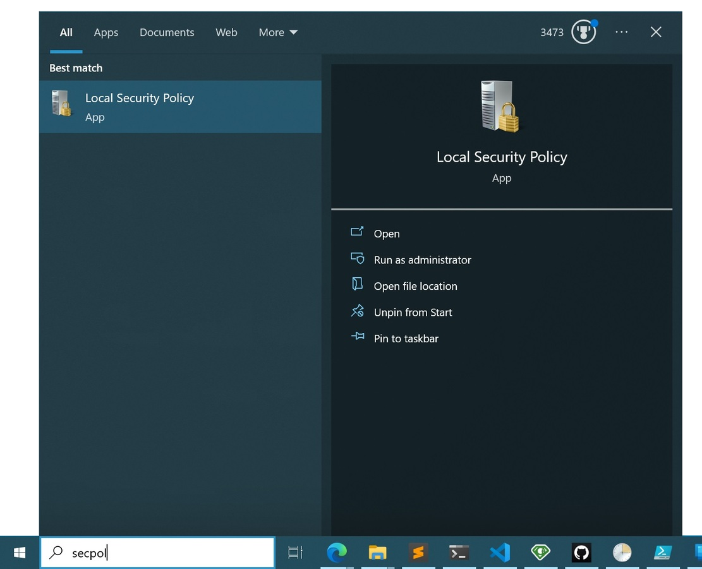
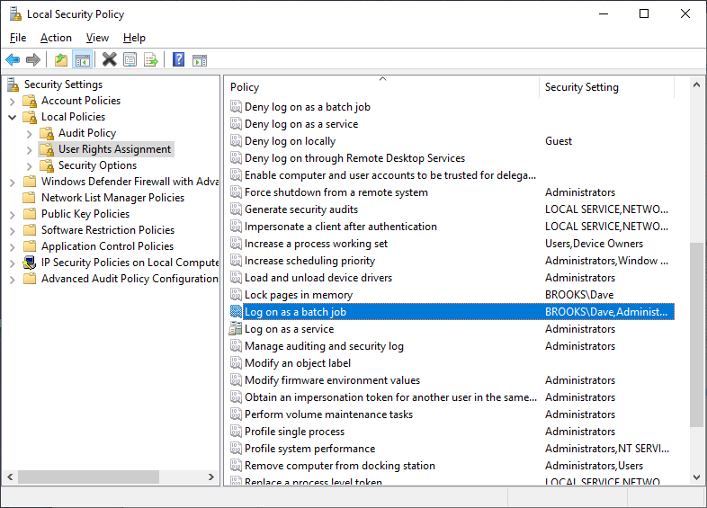

Callisto Scripts Repository
================

This repository contains a number of scripts that I have written or enhanced to setup/configure my dev machine. These are provided for free to the community under an MIT License.

# Auto-winget.
A scheduled task is configured to run on certain MsiInstaller events from the eventlog (i.e. whenever a program is installed). The posh script clones the `winget` branch of this repository, runs `winget export -o winget.json` and then commits & pushes.

### Local Security Policy (secpol.msc)
    Security Settings > Local Policies > User Rights Assignment > Log on as batch job

## Liability

**All scripts are provided as-is and you use them at your own risk.**

## Contribute

I would be happy to extend the collection of scripts. Just open an issue or
send me a pull request.

### Lots of stuff was copied from:
- [W4RH4WK/Debloat-Windows-10](https://github.com/W4RH4WK/Debloat-Windows-10)
- [ruudmens/LazyAdmin](https://github.com/ruudmens/LazyAdmin)

## License

    "THE BEER-WARE LICENSE" (Revision 42):

    As long as you retain this notice you can do whatever you want with this
    stuff. If we meet someday, and you think this stuff is worth it, you can
    buy us a beer in return.

    This project is distributed in the hope that it will be useful, but WITHOUT
    ANY WARRANTY; without even the implied warranty of MERCHANTABILITY or
    FITNESS FOR A PARTICULAR PURPOSE.